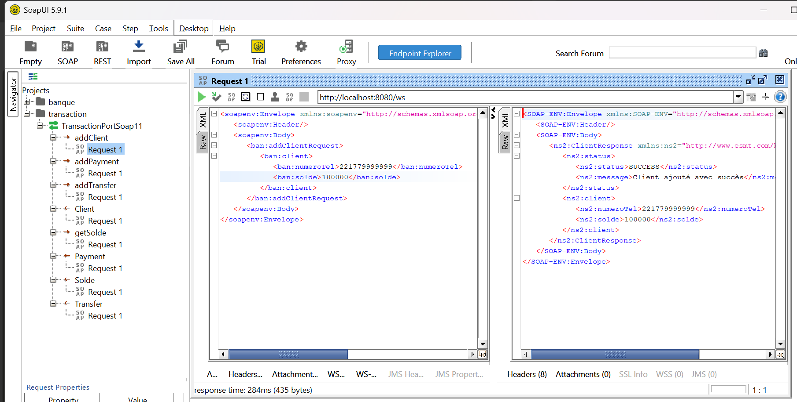
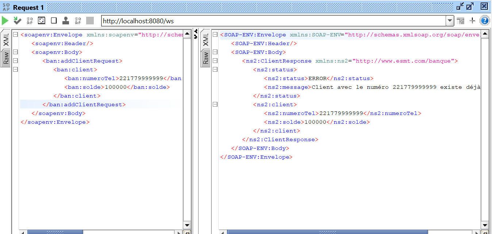
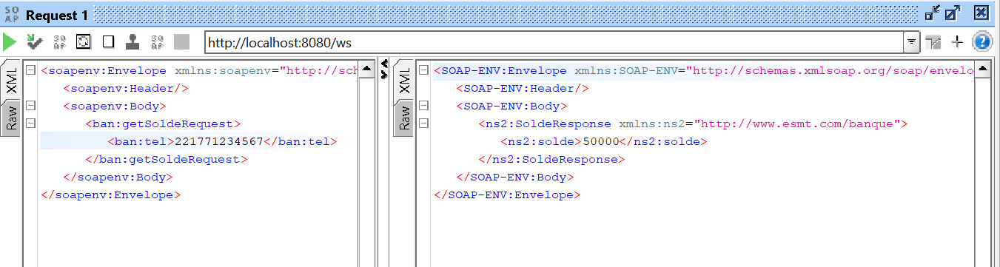
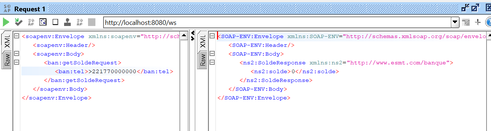
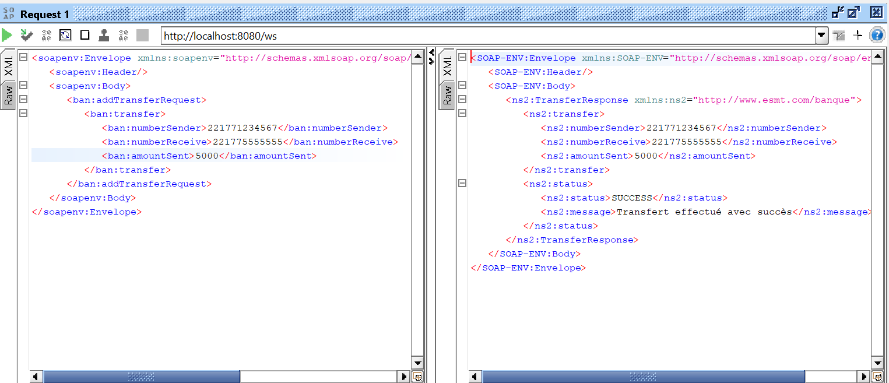

# 🏦 Multi-Schema SOAP Web Services with Spring Boot

[](https://spring.io/projects/spring-boot)
[](https://www.oracle.com/java/)
[](https://www.w3.org/TR/soap/)
[](LICENSE)

A comprehensive **Contract-First SOAP Web Service** implementation using Spring Boot, demonstrating multi-schema architecture with banking and transaction operations.

## 📋 Table of Contents

- [Features](#-features)
- [Architecture](#-architecture)
- [Technologies](#-technologies)
- [Project Structure](#-project-structure)
- [Getting Started](#-getting-started)
- [API Documentation](#-api-documentation)
- [Testing with SoapUI](#-testing-with-soapui)
- [Examples](#-examples)
- [Contributing](#-contributing)
- [License](#-license)

## ✨ Features

- 🔄 **Contract-First Development** - XSD-driven SOAP service design
- 🏗️ **Multi-Schema Architecture** - Separate schemas for different business domains
- 💰 **Banking Operations** - Account balance retrieval
- 💸 **Transaction Management** - Client management, transfers, and payments
- 🛡️ **Exception Handling** - Comprehensive error management with SOAP faults
- 📊 **Layered Architecture** - Clean separation of concerns (Endpoint → Service → Repository)
- 🔍 **Logging** - Detailed operation tracking with SLF4J
- ✅ **Validation** - Business rule validation (balance checks, client existence)

## 🏛️ Architecture
```
┌─────────────────────────────────────────────────────────────┐
│                      SOAP Client                            │
│                  (SoapUI, Postman, etc.)                    │
└────────────────────┬────────────────────────────────────────┘
                     │ SOAP/XML
                     ▼
┌─────────────────────────────────────────────────────────────┐
│                   Spring WS Layer                           │
│  ┌──────────────────┐        ┌──────────────────┐          │
│  │ BanqueEndpoint   │        │TransactionEndpoint│          │
│  └────────┬─────────┘        └────────┬──────────┘          │
└───────────┼──────────────────────────┼──────────────────────┘
            │                          │
            ▼                          ▼
┌─────────────────────────────────────────────────────────────┐
│                   Service Layer                             │
│                ┌──────────────────────┐                     │
│                │ TransactionService   │                     │
│                └──────────┬───────────┘                     │
└───────────────────────────┼─────────────────────────────────┘
                            │
                            ▼
┌─────────────────────────────────────────────────────────────┐
│                 Repository Layer                            │
│                ┌──────────────────┐                         │
│                │ ClientRepository │                         │
│                └──────────────────┘                         │
└─────────────────────────────────────────────────────────────┘
```

## 🛠️ Technologies

- **Java 17** - Programming language
- **Spring Boot 3.5.7** - Application framework
- **Spring Web Services** - SOAP implementation
- **JAXB** - XML binding
- **Maven** - Dependency management
- **Lombok** - Boilerplate reduction
- **SLF4J** - Logging framework

## 📁 Project Structure
```
soap-banque/
├── src/main/
│   ├── java/com/isi/soap_banque/
│   │   ├── config/
│   │   │   └── WebServiceConfig.java          # Spring WS configuration
│   │   ├── endpoint/
│   │   │   ├── BanqueEndpoint.java            # Account operations
│   │   │   └── TransactionEndpoint.java       # Transaction operations
│   │   ├── service/
│   │   │   └── TransactionService.java        # Business logic
│   │   ├── repository/
│   │   │   └── ClientRepository.java          # Data access
│   │   ├── exception/
│   │   │   ├── ClientNotFoundException.java
│   │   │   ├── InsufficientBalanceException.java
│   │   │   └── ClientAlreadyExistsException.java
│   │   ├── generated/                         # JAXB generated classes
│   │   │   ├── banque/
│   │   │   └── transaction/
│   │   └── SoapBanqueApplication.java         # Main application
│   └── resources/
│       ├── xsd/
│       │   ├── banque.xsd                     # Banking schema
│       │   └── transaction.xsd                # Transaction schema
│       └── application.properties
├── pom.xml
└── README.md
```

## 🚀 Getting Started

### Prerequisites

- Java 17 or higher
- Maven 3.6+
- SoapUI (for testing) or any SOAP client

### Installation

1. **Clone the repository**
```bash
   git clone https://github.com/yourusername/soap-banque.git
   cd soap-banque
```

2. **Build the project**
```bash
   mvn clean install
```

3. **Run the application**
```bash
   mvn spring-boot:run
```

4. **Verify the service is running**
    - Banking WSDL: http://localhost:8080/ws/banque.wsdl
    - Transaction WSDL: http://localhost:8080/ws/transaction.wsdl

## 📖 API Documentation

### Banking Service (banque.xsd)

#### Get Account Balance
Retrieves the balance of a bank account.

**Operation:** `getAccount`  
**Namespace:** `http://isi.com/banque`

**Request:**
```xml
<getAccountRequest>
    <accountNumber>12345</accountNumber>
</getAccountRequest>
```

**Response:**
```xml
<getAccountResponse>
    <balance>5000.50</balance>
</getAccountResponse>
```

---

### Transaction Service (transaction.xsd)

All operations use namespace: `http://www.esmt.com/banque`

#### 1. Add Client
Creates a new client account.

**Operation:** `addClient`

**Request:**
```xml
<addClientRequest>
    <client>
        <numeroTel>221771234567</numeroTel>
        <solde>50000</solde>
    </client>
</addClientRequest>
```
**Response:**
```xml
<ClientResponse>
    <status>
        <status>SUCCESS</status>
        <message>Client ajouté avec succès</message>
    </status>
    <client>
        <numeroTel>221771234567</numeroTel>
        <solde>50000</solde>
    </client>
</ClientResponse>
```

#### 2. Get Balance
Retrieves a client's balance.

**Operation:** `getSolde`

**Request:**
```xml
<getSoldeRequest>
    <tel>221771234567</tel>
</getSoldeRequest>
```

**Response:**
```xml
<SoldeResponse>
    <solde>50000</solde>
</SoldeResponse>
```

#### 3. Transfer Funds
Transfers money between two clients.

**Operation:** `addTransfer`

**Request:**
```xml
<addTransferRequest>
    <transfer>
        <numberSender>221771234567</numberSender>
        <numberReceive>221775555555</numberReceive>
        <amountSent>5000</amountSent>
    </transfer>
</addTransferRequest>
```

**Response:**
```xml
<TransferResponse>
    <transfer>
        <numberSender>221771234567</numberSender>
        <numberReceive>221775555555</numberReceive>
        <amountSent>5000</amountSent>
    </transfer>
    <status>
        <status>SUCCESS</status>
        <message>Transfert effectué avec succès</message>
    </status>
</TransferResponse>
```

#### 4. Make Payment
Adds funds to a client account.

**Operation:** `addPayment`

**Request:**
```xml
<addPaymentRequest>
    <payment>
        <numberReceive>221775555555</numberReceive>
        <amountSent>10000</amountSent>
    </payment>
</addPaymentRequest>
```

**Response:**
```xml
<PaymentResponse>
    <payment>
        <numberReceive>221775555555</numberReceive>
        <amountSent>10000</amountSent>
    </payment>
    <status>
        <status>SUCCESS</status>
        <message>Paiement effectué avec succès</message>
    </status>
</PaymentResponse>
```

## 🧪 Testing with SoapUI

### Setup

1. **Create new SOAP Project**
    - File → New SOAP Project
    - Initial WSDL: `http://localhost:8080/ws/transaction.wsdl`
    - Check "Create Requests"

2. **Test Endpoints**
    - Navigate to the operation you want to test
    - Modify the auto-generated request
    - Click the green play button ▶️

### Test Scenarios

#### 🧪 Test 1: Add a New Client

**Request:**
```xml
<soapenv:Envelope xmlns:soapenv="http://schemas.xmlsoap.org/soap/envelope/" 
                  xmlns:ban="http://www.esmt.com/banque">
   <soapenv:Body>
      <ban:addClientRequest>
         <ban:client>
            <ban:numeroTel>221779999999</ban:numeroTel>
            <ban:solde>100000</ban:solde>
         </ban:client>
      </ban:addClientRequest>
   </soapenv:Body>
</soapenv:Envelope>
```

**Expected:** ✅ SUCCESS - Client created

---

#### 🧪 Test 2: Add Existing Client (Error Case)

**Request:**
```xml
<ban:addClientRequest>
   <ban:client>
      <ban:numeroTel>221771234567</ban:numeroTel>
      <ban:solde>50000</ban:solde>
   </ban:client>
</ban:addClientRequest>
```

**Expected:** ❌ ERROR - "Client avec le numéro 221771234567 existe déjà"

---

#### 🧪 Test 3: Get Balance

**Request:**
```xml
<ban:getSoldeRequest>
   <ban:tel>221771234567</ban:tel>
</ban:getSoldeRequest>
```

**Expected:** ✅ Returns balance: 50000

---

#### 🧪 Test 4: Get Balance (Non-existent Client)

**Request:**
```xml
<ban:getSoldeRequest>
   <ban:tel>221770000000</ban:tel>
</ban:getSoldeRequest>
```

**Expected:** ✅ Returns: 0

---

#### 🧪 Test 5: Successful Transfer

**Request:**
```xml
<ban:addTransferRequest>
   <ban:transfer>
      <ban:numberSender>221771234567</ban:numberSender>
      <ban:numberReceive>221775555555</ban:numberReceive>
      <ban:amountSent>5000</ban:amountSent>
   </ban:transfer>
</ban:addTransferRequest>
```

**Expected:** ✅ SUCCESS - Transfer completed

---

#### 🧪 Test 6: Transfer with Insufficient Balance

**Request:**
```xml
<ban:addTransferRequest>
   <ban:transfer>
      <ban:numberSender>221771234567</ban:numberSender>
      <ban:numberReceive>221775555555</ban:numberReceive>
      <ban:amountSent>1000000</ban:amountSent>
   </ban:transfer>
</ban:addTransferRequest>
```

**Expected:** ❌ ERROR - "Solde insuffisant"

## 📊 Examples

### Using Postman

**Endpoint:** `http://localhost:8080/ws`

**Headers:**
```
Content-Type: text/xml
SOAPAction: ""
```

**Body (Get Balance Example):**
```xml
<soapenv:Envelope xmlns:soapenv="http://schemas.xmlsoap.org/soap/envelope/" 
                  xmlns:ban="http://www.esmt.com/banque">
   <soapenv:Body>
      <ban:getSoldeRequest>
         <ban:tel>221771234567</ban:tel>
      </ban:getSoldeRequest>
   </soapenv:Body>
</soapenv:Envelope>
```

### Using cURL
```bash
curl -X POST http://localhost:8080/ws \
  -H "Content-Type: text/xml" \
  -d '<soapenv:Envelope xmlns:soapenv="http://schemas.xmlsoap.org/soap/envelope/" xmlns:ban="http://www.esmt.com/banque">
        <soapenv:Body>
           <ban:getSoldeRequest>
              <ban:tel>221771234567</ban:tel>
           </ban:getSoldeRequest>
        </soapenv:Body>
      </soapenv:Envelope>'
```

## 🔍 Error Handling

The service provides detailed error responses:

| Error | Status | Message |
|-------|--------|---------|
| Client Not Found | ERROR | "Client non trouvé: {numero}" |
| Client Already Exists | ERROR | "Client avec le numéro {numero} existe déjà" |
| Insufficient Balance | ERROR | "Solde insuffisant pour le client {numero}" |
| Invalid Amount | ERROR | "Le montant doit être positif" |

## 🤝 Contributing

Contributions are welcome! Please follow these steps:

1. Fork the repository
2. Create a feature branch (`git checkout -b feature/AmazingFeature`)
3. Commit your changes (`git commit -m 'Add some AmazingFeature'`)
4. Push to the branch (`git push origin feature/AmazingFeature`)
5. Open a Pull Request

## 📝 License

This project is licensed under the MIT License - see the [LICENSE](LICENSE) file for details.

## 👨‍💻 Author

**Bonevy BEBY **
- GitHub: [@yourusername](https://github.com/zoulou421/)
- LinkedIn: [Your LinkedIn](https://www.linkedin.com/in/bonevybeby/)

## 🙏 Acknowledgments

- Spring Team for excellent SOAP support
- JAXB for XML binding
- The open-source community

## 📞 Support

If you have any questions or issues, please:
- Open an issue on GitHub
- Contact: bonevybeby@gmail.com
- Contact number: 00221 77 862 72 72

---

**⭐ If you find this project useful, please consider giving it a star!**

Made with ❤️ using Spring Boot